# LogiSphere Infrastructure Lab

## Project Status
Current Phase: Active Directory Deployment

Completed:
- Base Server Configuration
- Active Directory Installation

In Progress:
- Organizational Units (OU)
- User Management

Planned:
- Group Policy Objects (GPO),
- Shared Folders
- Windows 11 Domain Client

## Project Overview

This project simulates the IT infrastructure of a logistics company using 
Windows Server 2022 and Active Directory.

## Lab Scenario
LogiSphere is a fictional logistics company used for learning and testing Windows Server administration.

Departments:
- IT
- HR
- Accounting
- Warehouse
- Management

Infrastructure Goals:
- Centralized authentication
- User and group management
- Group Policy administration
- Shared folders and permissions
- Domain-joined client computers

## Environment
- Windows Server 2022,
- Oracle VirtualBox
- Windows 11 Client (planned)
- Active Directory Domain Services (AD DS)
- Domain: logisphere.local

## Phase 1 - Base Server Configuration

Completed:
- Installed Windows Server 2022,
- Renamed server to DC01,
- Configured static IPv4 address (192.168.10.10),
- Configured DNS settings,
- Configured time zone,
- Created VirtualBox snapshot (DC01_BASE),

## Screenshots

### Server renamed to DC01


### Static IP Configuration


## Phase 2 - Active Directory Deployment

### Active Directory Domain Services Installed
Successfully installed the Active Directory Domain Services (AD DS) role on DC01.
The server is now ready to be promoted to the first Domain Controller of the LogiSphere.local domain.


### Active Directory Forest Creation
Created a new Active Directory forest named logisphere.local for the LogiSphere logistics company infrastructure. 


### Domain Controller Configuration
Configured the first Domain Controller for the logisphere.local forest.
Enabled DNS Server and Global Catalog roles.
Configured Directory Services Restore Mode (DSRM) password.


### NetBIOS Domain Configuration
Configured the NetBIOS domain name for the Active Directory environment.
NetBIOS name: LOGISPHERE
Domain name: logisphere.local


### Active Directory Deployment Review
Review the Active Directory deployment configuration before promoting DC01 to the first Domain Controller.
Configuration:
- Domain: logisphere.local
- NetBIOS: LOGISPHERE
- Forest Functional Level: Windows Server 2016 
- Domain Functional Level: Windows Server 2016
- DNS Server: Enabled
- Global Catalog: Enabled


### Active Directory Prerequisites Check
Validated the Active Directory Domain Services configuration before domain controller promotion.
Results:
- All prerequisites checks passed successfully 
- DNS role configured
- Global Catalog enabled
- Forest root domain: logisphere.local
- Domain controller promotion ready


### Domain Controller Login
After Active Directory Domain Services installation and server promotion, DC01 successfully joined the LOGISPHERE domain as the first Domain Controller.
Login account: LOGISPHERE\Administrator
Domain: logisphere.local


### Active Directory Management Tools Available

After promoting DC01 to a Domain Controller, Active Directory managment tools became available in Server Manager.
Installed managment tools:
- Active Directory Users and Computers
- Active Directory Administrative Center
- Active Directory Domains and Trusts
- Active Directory Sites and Services
- DNS Manager
- Group Policy Management

The server is fully operational as a Domain Controller for the LogiSphere domain.


## Phase 3 - Organizational Unit Structure

### Organizational Units Created

Created the Organizational Unit (OU) structure for the LogiSphere Active Directory environment.

Departments:
- IT
- HR
- Accounting
- Warehouse
- Management

Additional Organizational Units:
- Groups
- Workstations

This structure will be used to organize users, computers, security groups and Group Policy Objects (GPOs).


## Phase 4 - User Management

### First Domain User Created

Created the first domain user account for the LogiSphere Active Directory environment.

User details:
- Name: Lukas Schneider
- Department: IT
- Username: l.schneider
- Domain: logisphere.local

The account was created inside the IT Organizational Unit (OU) following the company structure.


### Department Users Accounts Created

Created domain user accounts for all LogiSphere departments.

### IT
- Lukas Schneider
- Felix Weber


### HR
- Anna Berg
- Julia Fischer


### Accounting
- Thomas Becker
- Sandra Wagner


### Warehouse
- Michael Hoffmann
- Kevin Schulz


### Management
- Markus Kaiser


Each user account was created inside its corresponding Organizational Unit (OU) to maintain a structured Active Directory environment.

## Phase 5 - Security Groups

Created dedicated Active Directory Security Groups for each department.

Security Groups:
- GG_IT
- GG_HR
- GG_ACCOUNTING
- GG_WAREHOUSE
- GG_MANAGEMENT

All groups were created as:
- Group Scope: Global
- Group Type: Security

Department users were assigned to their corresponing security groups to simplify permission management and feature access control configuration.

### Department Security Groups


## Phase 6 - File Server and NTFS Permissions

### Department Shared Folders

Created departmental shared folders and configured NTFS permissions based on Active Directory Security Groups.


### NTFS Permissions Configuration

Configured NTFS permissions using Active Directory Security Groups.

Example:
- GG_IT = Modify
- Administrators = Full Control
- SYSTEM = Full Control

Inheritance was disabled to ensure department specific access control.


### SMB Network Shares

Configured SMB network shares for all company departments.
Available shared folders:
- Accounting
- HR
- IT
- Management
- Warehouse

Verified network access using: \\localhost

The shares are accessible over the network and integrated with Active Directory security groups and NTFS permissions.


## Phase 7 - Windows 10 Domain Client Deployment

### Client Network Configuration

Configured a Windows 10 client machine for communication with the Active Directory environment.

Client Configuration:
- Hostname: WIN10-CLIENT
- IP Address: 192.168.10.20
- Subnet Mask: 255.255.255.0
- DNS Server: 192.168.10.10

The client was connected to the LABNET internal network in Oracle VirtualBox.


### Connectivity Verification

Verified network communication between the Windows 10 client and the Domain Controller (DC01).

Test:
- ping 192.168.10.10

Result:
- Successful communication
- 0% packet loss


### DNS Resolution Test

Verified DNS name resolution from the Windows 10 client using the Domain Controller DNS service.

Tests performed:
- nslookup dc01.logisphere.local
- nslookup logisphere.local

Results:
- dc01.logisphere.local resolved to 192.168.10.10
- logisphere.local resolved to 192.168.10.10

The client was successfully communicates with the DNS service hosted on DC01.


## Phase 8 - Domain Join

### Domain Join Preperation

Opened the Windows 10 client computer name and domain membership settings.

The client was still operating in the default WORKGROUP configuration before joining the Active Directory domain.

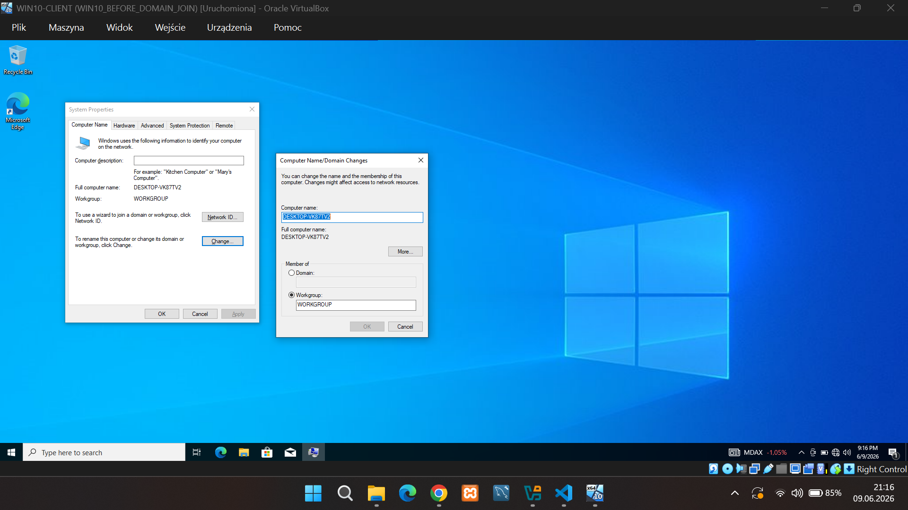

### Windows 10 Client Joined to Domain

Successfully joined the Windows 10 client computer to the logisphere.local Active Directory domain.
The domain join operation was completed using administrator credentials and the computer became a member of the LogiSphere infrastructure.

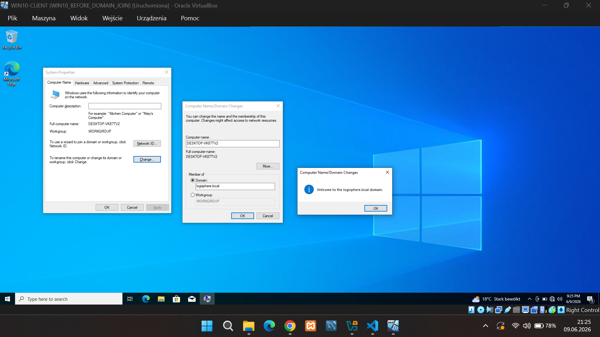

### Domain User Authentication Verification

Verified successful Active Directory authentication from the Windows 10 domain joined workstation.

Commands executed:
- whoami
- hostname

Results:
- User: LOGISPHERE\l.schneider
- Workstation: DESKTOP-VK87TV2

The user was succesfully authenticated against Active Directory and received a domain profile.

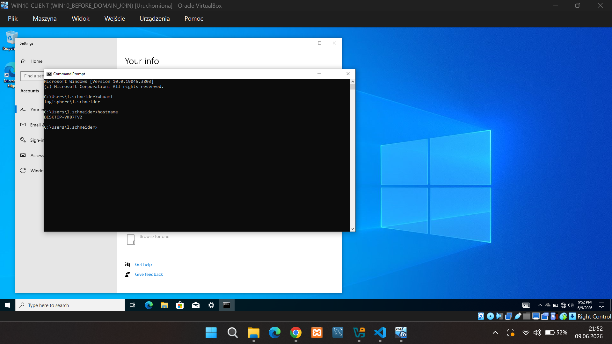

### Group Policy Verification

Verified Active Directory authentication and Group Policy processing on the domain joined Windows 10 workstation using the gpresult /r command.

Results:
- User authenticated: LOGISPHERE\l.schneider
- Domain Controller: DC01.logisphere.local
- Domain: LOGISPHERE
- User profile loaded successfully
- Security group membership verified (GG_IT)
- Group Policy processing completed successfully

This confirm that the workstation is properly joined to the AD domain and can communicate with the Domain Controller.
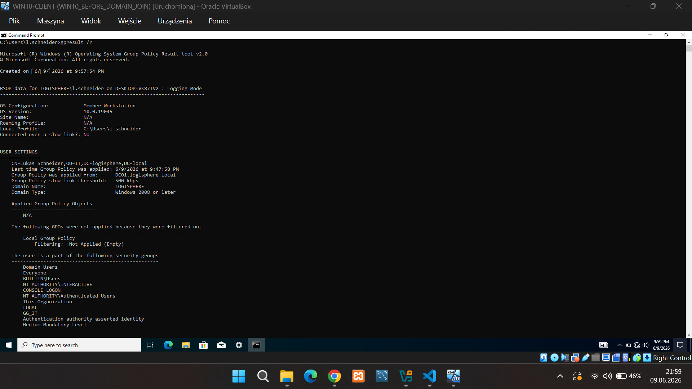

## Phase 9 - Group Policy Objects (GPO)

Created and linked multiple Group Policy Objects (GPOs) to the IT Organizational Unit in Active Directory.

### Implemented Policies

#### Control Panel Restriction
Configured a user policy to prevent access to:
- Control Panel
- Windows Settings

#### Password Policy
Configured domain password requirements:
- Password Complexity Requirements Enabled
- Minimum Password Length: 8 characters
- Password History Enabled
- Maximum Password Age configured

#### Account Lockout Policy
Configured protection against brute-force attacks:
- Account Lockout Threshold: 3 failed logon attempts
- Account Lockout Duration: 30 minutes
- Reset Lockout Counter After: 30 minutes

### Validation Steps

- Logged in using domain account (LOGISPHERE\l.schneider)
- Forced Group Policy refresh using `gpupdate /force`
- Verified applied policies using `gpresult`
- Confirmed Control Panel restriction was enforced
- Tested account lockout by entering incorrect passwords
- Verified user account was automatically locked after 3 failed attempts

### Active Directory Replication

Validated Active Directory replication using:

```cmd
repadmin /syncall
```

Replication completed successfully with no errors.

### Result

Successfully deployed and validated:
- User Restriction Policies
- Password Policies
- Account Lockout Protection
- Active Directory Replication
- Group Policy Processing and Troubleshooting

The Windows 10 domain-joined client correctly received and enforced all configured policies.
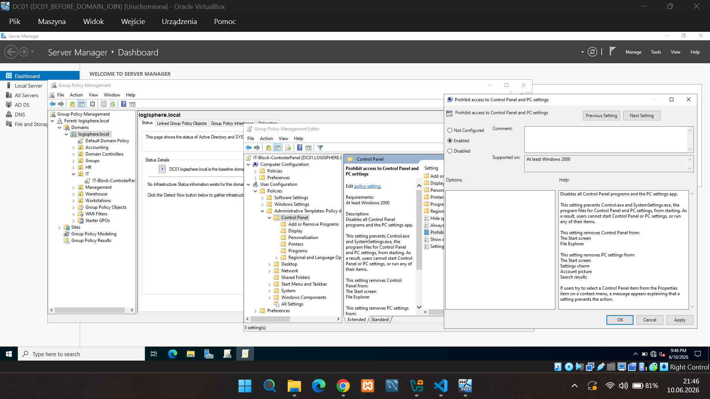
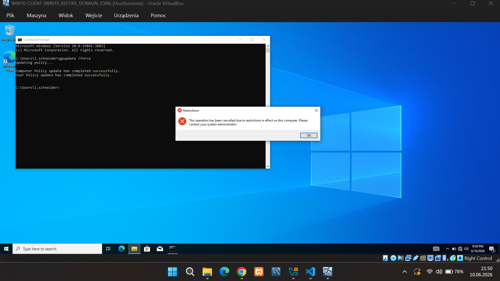

### Password Policy
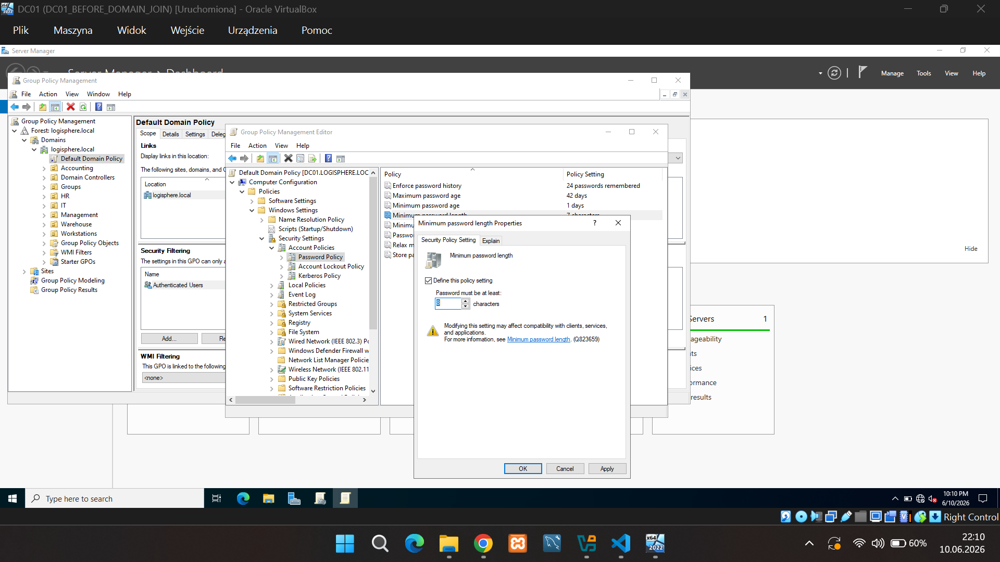

### Account Lockout Policy


### Account Locked
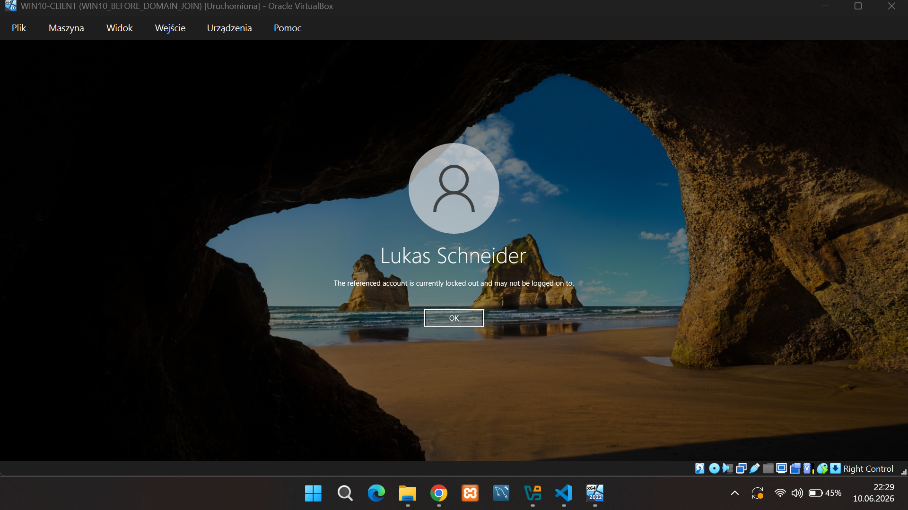

### GPO Verification
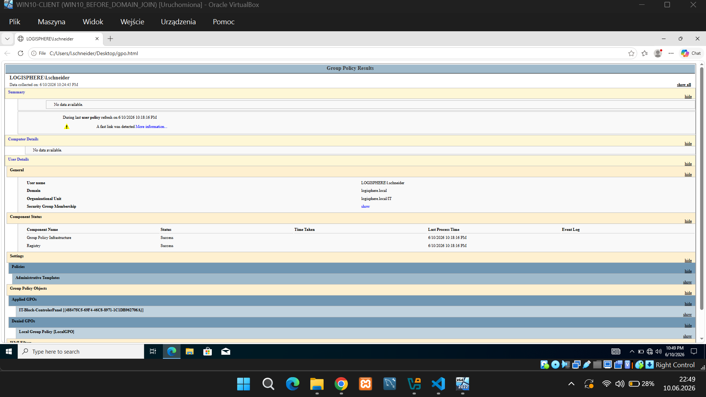

### Active Directory Replication
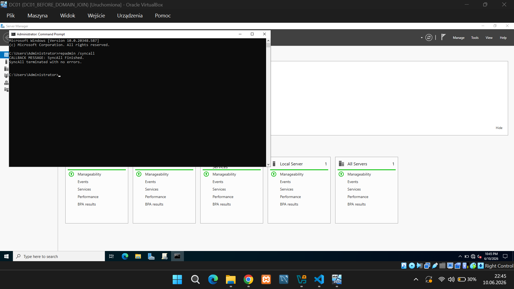

## Phase 10 - Drive Mapping via Group Policy

Created a Group Policy Object (GPO) to automatically map a departmental network drive for users located in the IT Organizational Unit.

Configuration:
- Created GPO: IT-Drive-Mapping
- Linked GPO to IT OU
- Configured Drive Mapping using Group Policy Preferences
- Mapped network share \\DC01\IT
- Assigned drive letter I:
- Enabled automatic reconnect at user logon

Validation steps:
- Logged in as domain user (LOGISPHERE\l.schneider)
- Forced Group Policy update using gpupdate /force
- Logged off and signed in again
- Verified successful drive mapping

Result:
The network drive was automatically mapped and appeared as:

IT Department (I:)

This demonstrates centralized drive deployment using Active Directory and Group Policy.

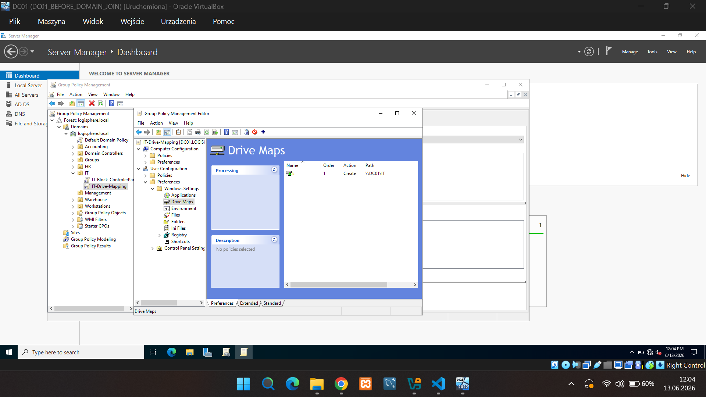

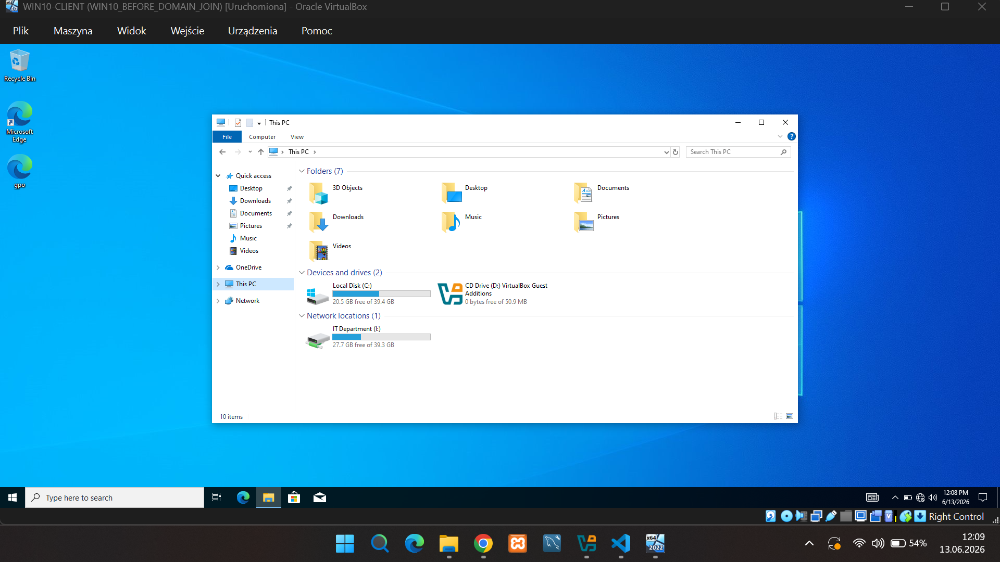

## Phase 11 - User Logon Script via Group Policy

- Created a User Logon Script using Group Policy
- Stored script in the GPO SYSVOL folder
- Linked GPO to the IT Organizational Unit
- Applied policy to domain users
- Verified successful script execution during user logon

Result:

A welcome message is displayed automatically when the user signs in.

This demonstrates centralized user logon automation using Active Directory and Group Policy.

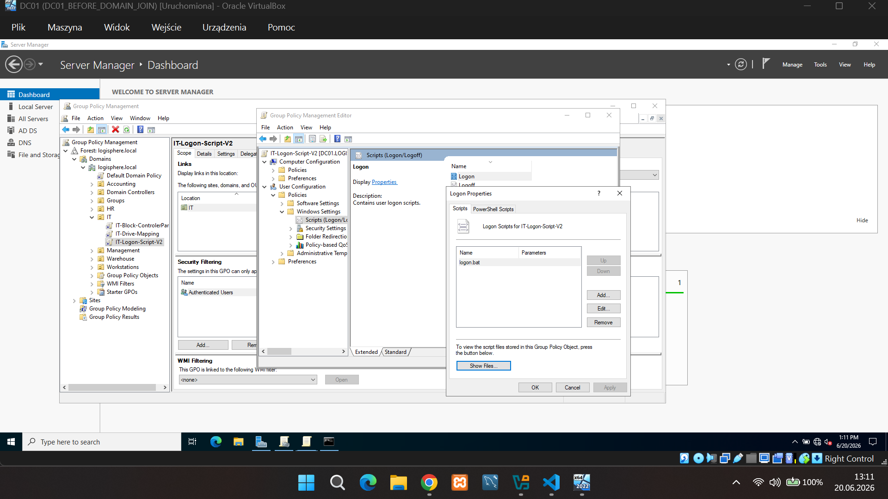

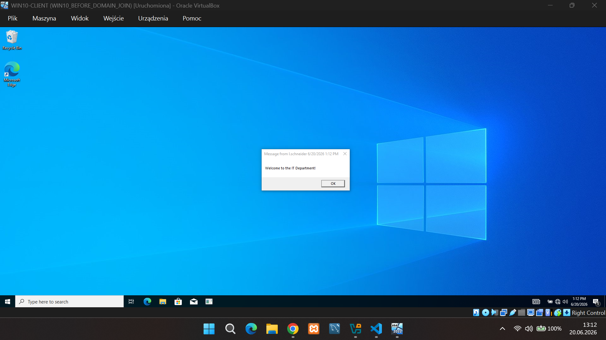


